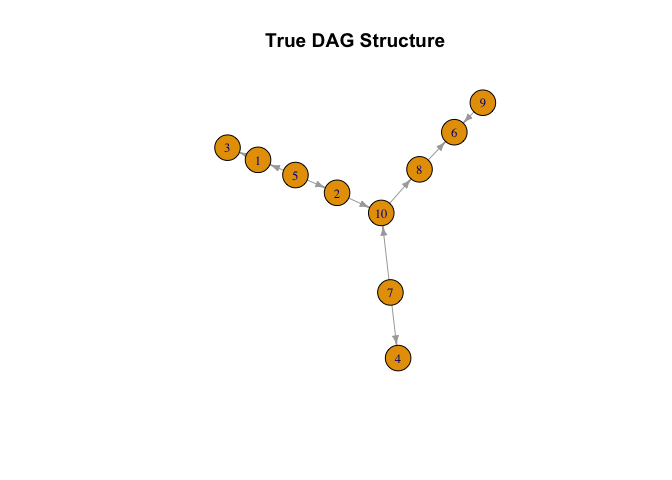
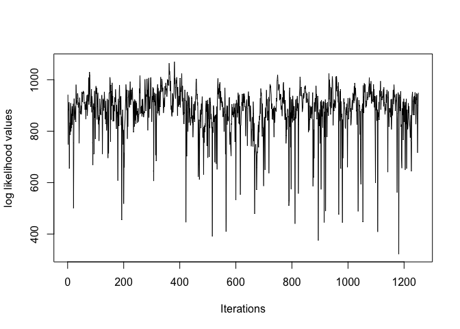
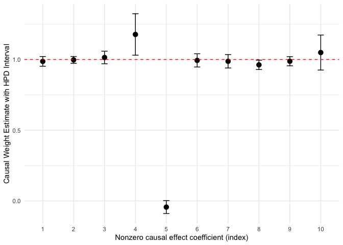
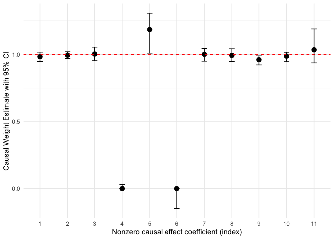
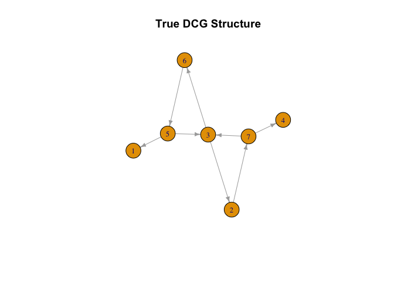
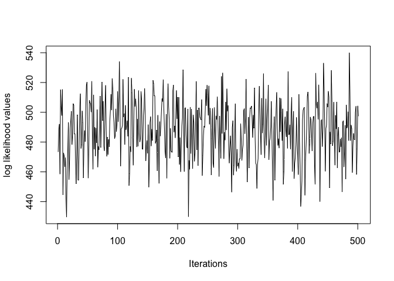

<!-- README.md is generated from README.Rmd. Please edit that file -->

# cyclinbayes

<!-- badges: start -->

<!-- badges: end -->

Cyclinbayes is an R package implementing bayesian methods for estimating
both directed acyclic graphs (DAGs) and directed cyclic graphs (DCGs).
The package provides full posterior inference for graph structures and
causal effects using a hierarchical Bayesian model, allowing principled
uncertainty quantification, edge inclusion probabilities, and credible
intervals.

For DAGs, cyclinbayes uses a hybrid MCMC scheme that combines collapsed
Gibbs sampling with simulated annealing to improve mixing and avoid
local optima. For DCGs, the package performs joint updates of adjacency
and causal effect coefficients using random walk proposals, enabling
inference in systems with feedback cycles. For DCGs, the package
performs joint updates of adjacency and causal effect coefficients using
random walk proposals, enabling inference in systems with feedback
cycles. In both settings, sparsity is effectively recovered using spike
and slab priors.

Implemented in Rcpp, cyclinbayes leverages optimized C++ routines to
handle large scale, high dimensional datasets.

## Installation from Github

You can install the development version of cyclinbayes from GitHub using
remotes:

``` r
#install.packages("remotes")
#remotes::install_github("roblee01/cyclinbayes")
```

Then load the package:

``` r
library(cyclinbayes)
library(ggplot2)
#> Warning: package 'ggplot2' was built under R version 4.5.2
library(igraph)
#> Warning: package 'igraph' was built under R version 4.5.2
#> 
#> Attaching package: 'igraph'
#> The following objects are masked from 'package:stats':
#> 
#>     decompose, spectrum
#> The following object is masked from 'package:base':
#> 
#>     union

# If using dist_type = "sid" and you see missing RBGL/graph:
#install.packages("BiocManager")
#BiocManager::install(c("graph", "RBGL"))
```

## Acyclic (DAG) Example

Below is a simple example demonstrating how to use the Bayesian LiNGAM
(DAG) sampler. Let $p$ denote the number of variables, $N$ the sample
size, and `num_iter` be the number of iterations of the sampler. Let
$i \in \lbrace 1,\ldots,p \rbrace$ index variables and
$q \in \lbrace 1,\ldots,N \rbrace$ index samples. We generate error
terms from a finite Gaussian mixture model:

$$
\epsilon_i^{(q)} \sim \sum_{k=1}^{M} \pi_{ik}\, N(\mu_{ik}, \tau_{ik}),
$$

with mixture components

$$
M = 2, \quad 
(\mu_{i1}, \mu_{i2}) = (-0.5, 0.5), \quad
(\tau_{i1}, \tau_{i2}) = (0.1, 0.3), \quad
(\pi_{i1}, \pi_{i2}) = (0.5, 0.5).
$$

We generate a sparse causal effect matrix $B$ by sampling edges
independently with probability $\Delta = 0.9$ until the adjacency matrix
is acyclic.

Given $B$ and the error matrix $\epsilon$, the data are generated via

$$
Y = (I - B)^{-1}\epsilon,
$$

where the $i$-th row of $Y$ corresponds to

$$
(Y_i^{(1)}, \ldots, Y_i^{(N)})^\top.
$$

``` r
#set.seed for reproducibility
set.seed(21)


#######################################
# Simulation and MCMC settings
#######################################
N = 300    # sample size
num_covariates = 10     # number of features
M = 2      # number of mixture components
num_iter = 1000  # number of MCMC iterations

#######################################
# Hyperparameter setup
#######################################
params = list(
  a_mu = 0,
  b_mu  = 2,
  a_gamma = 0.5,
  b_gamma = 0.5,
  a_gamma_1 = 2,
  b_gamma_1 = 1,
  a_tao = 2,
  b_tao = 1,
  a_og_tao = 0.01,
  b_og_tao = 0.01,
  alpha = 1
)

#######################################
# Generate DAG example data
#######################################
example_list = generates_examples_DAG(
  num_covariates = num_covariates,
  N = N,
  M = M,
  prob_sparsity = 0.9,
  seed_input = 21
)

data_matrix = example_list$data_matrix
Adjacency_matrix_true = example_list$Adjacency_matrix_true
```

Before examining posterior summaries, it is helpful to visualize the
true underlying DAG used in the simulation. This provides a direct point
of comparison for the estimated graph structures returned by the
sampler. The plot below displays the ground truth adjacency structure,
where each directed edge represents a causal relationship from one
variable to another.

``` r
#######################################
# Build directed graph from adjacency matrix
#######################################

g_true = igraph::graph_from_adjacency_matrix(
Adjacency_matrix_true,
mode = "directed",
diag = FALSE
)

plot(
  g_true,
  vertex.size = 20,
  vertex.label.cex = 0.8,
  edge.arrow.size = 0.5,
  main = "True DAG Structure"
)
```



With the simulated dataset and prior hyperparameters specified above, we
fit the Bayesian LiNGAM model using `BayesDAG().` Each MCMC iteration
$$t$$ produces:

- Adjacency matrix $E^{(t)}\in \{0,1\}^{p\times p}$
- Causal effect matrix $B^{(t)}\in \mathbb{R}^{p\times p}$
- Mixture parameters for the error model, with component specific means
  and variances/precisions stored in matrices (e.g.,
  $\mu^{(t)},\tau^{(t)}\in \mathbb{R}^{p\times M}$, where column $k$
  corresponds to mixture component $k$).

For posterior summaries, each iteration’s matrices are flattened
(vectorized) into a single parameter vector. Concretely, we apply
$vec(\cdot)$ to stack all entries of $E^{(t)}$, $B^{(t)}$, $\mu^{(t)}$,
and $\tau^{(t)}$, and stack these vectors over iterations to form a
matrix of samples where the rows are iterations and columns correspond
to fixed matrix entries (one column for $B_{ij}$ or $\mu_{ik}$). This
makes element wise quantities, edge probabilities, HPD/credible
intervals, and other summaries straightforward to compute.

``` r
#######################################
# Run Bayesian LiNGAM (DAG) sampler
#######################################
results_lists = BayesDAG(
  data_matrix,
  params$a_mu,
  params$b_mu,
  params$a_gamma,
  params$b_gamma,
  params$a_tao,
  params$b_tao,
  params$a_og_tao,
  params$b_og_tao,
  params$a_gamma_1,
  params$b_gamma_1,
  params$alpha,
  M,
  num_iter
)

#######################################
# Extract key posterior summaries
#######################################
log_likelihood_list = results_lists$log_likelihood_list
Adjacency_matrix_list = results_lists$Adjacency_matrix_list 
Causal_effect_matrix_list = results_lists$Causal_effect_matrix_list
gamma_list = results_lists$gamma_list
gamma_1_list = results_lists$gamma_1_list
mu_matrix_list = results_lists$mu_matrix_list
tao_matrix_list = results_lists$tao_matrix_list
pi_matrix_list = results_lists$pi_matrix_list
```

To obtain a representative estimate of the graph structure, we use the
function `point_est_graph(),` which selects the posterior weighted
medoid, the graph that minimizes the weight distance to all other
sampled adjacency matrices. Users may select one of the build in
distances or supply their own custom functions. The available distance
metrics are:

- **Structural Hamming Distance (SHD):**  
  Counts the number of single edge edits (additions, deletions, or
  reversals) required to transform one graph into another.

- **Structural Intervention Distance (SID):**  
  Measures how many node pairs $(i, j)$ imply different intervention
  distributions P($\mathbf{Y}_j$ \| do($\mathbf{Y}_i$)).  
  (Applicable only when the posterior graphs are DAGs)

Users may also specify

``` r
dist_type = 'custom'
dist_fun = function(A,B){...}
```

where $A$ and $B$ are $p\times p$ adjacency matrices. The function must
return a non negative scalar distance.

``` r
#############################################
# Best Graph Structure determined through shd
#############################################
Adjacency_matrix_shd = point_est_graph(Adjacency_matrix_list, dist_type = 'shd')
Adjacency_matrix_shd
#>       [,1] [,2] [,3] [,4] [,5] [,6] [,7] [,8] [,9] [,10]
#>  [1,]    0    0    1    0    0    0    0    0    0     0
#>  [2,]    0    0    0    0    0    0    0    0    0     1
#>  [3,]    0    0    0    0    0    0    0    0    0     0
#>  [4,]    0    0    0    0    0    0    0    0    0     0
#>  [5,]    1    1    0    0    0    0    0    0    0     0
#>  [6,]    0    0    0    0    0    0    0    0    0     0
#>  [7,]    0    0    0    1    0    0    0    0    0     1
#>  [8,]    0    0    0    0    0    1    0    0    0     0
#>  [9,]    0    0    0    0    0    1    0    0    0     0
#> [10,]    0    0    0    0    0    0    0    1    0     0
```

``` r
############################################
# Best Graph Structure determined through sid
############################################
if (requireNamespace("SID", quietly = TRUE)) {
  Adjacency_matrix_sid = point_est_graph(Adjacency_matrix_list, dist_type = "sid")
  Adjacency_matrix_sid
} else {
  message("SID not installed. Install SID (and possibly Bioconductor graph/RBGL) to run SID.")
}
#>       [,1] [,2] [,3] [,4] [,5] [,6] [,7] [,8] [,9] [,10]
#>  [1,]    0    0    1    0    0    0    0    0    0     0
#>  [2,]    0    0    0    0    0    0    0    0    0     1
#>  [3,]    0    0    0    0    0    0    0    0    0     0
#>  [4,]    0    0    0    0    0    0    0    0    0     0
#>  [5,]    1    1    0    0    0    0    0    0    0     0
#>  [6,]    0    0    0    0    0    0    0    0    0     0
#>  [7,]    0    0    0    1    0    0    0    0    0     1
#>  [8,]    0    0    0    0    0    1    0    0    0     0
#>  [9,]    0    0    0    0    0    1    0    0    0     0
#> [10,]    0    0    0    0    0    0    0    1    0     0
```

As an example for a custom function, we could count the total number of
edge mismatches.

``` r
custom_edge_mismatch = function(A, B) {
  return(sum(abs(A - B)))
}

Adjacency_matrix_custom = point_est_graph(Adjacency_matrix_list, dist_type = 'custom', dist_fun = custom_edge_mismatch)
Adjacency_matrix_custom
#>       [,1] [,2] [,3] [,4] [,5] [,6] [,7] [,8] [,9] [,10]
#>  [1,]    0    0    1    0    0    0    0    0    0     0
#>  [2,]    0    0    0    0    0    0    0    0    0     1
#>  [3,]    0    0    0    0    0    0    0    0    0     0
#>  [4,]    0    0    0    0    0    0    0    0    0     0
#>  [5,]    1    1    0    0    0    0    0    0    0     0
#>  [6,]    0    0    0    0    0    0    0    0    0     0
#>  [7,]    0    0    0    1    0    0    0    0    0     1
#>  [8,]    0    0    0    0    0    1    0    0    0     0
#>  [9,]    0    0    0    0    0    1    0    0    0     0
#> [10,]    0    0    0    0    0    0    0    1    0     0
```

We observe that the three structures selected using different distance
metrics are all identical.

``` r
Adjacency_matrix_true
#>       [,1] [,2] [,3] [,4] [,5] [,6] [,7] [,8] [,9] [,10]
#>  [1,]    0    0    1    0    0    0    0    0    0     0
#>  [2,]    0    0    0    0    0    0    0    0    0     1
#>  [3,]    0    0    0    0    0    0    0    0    0     0
#>  [4,]    0    0    0    0    0    0    0    0    0     0
#>  [5,]    1    1    0    0    0    0    0    0    0     0
#>  [6,]    0    0    0    0    0    0    0    0    0     0
#>  [7,]    0    0    0    1    0    0    0    0    0     1
#>  [8,]    0    0    0    0    0    1    0    0    0     0
#>  [9,]    0    0    0    0    0    1    0    0    0     0
#> [10,]    0    0    0    0    0    0    0    1    0     0
```

In addition to choosing the best possible graphs through distance based
medoids, users may evaluate how often a graph appears in structure
appears in the posterior samples. This provides posterior support for
any candidate DAG, such as the true graph.

The function `posterior_network_motif()` computes the posterior mass
(relative frequency) of a graph by checking whether all its edges are
present on each of the posterior graph structures. Using the adjacency
samples from the acyclic example above, we can compute the posterior
mass assigned to the true graph:

``` r
true_graph_structure = igraph::graph_from_adjacency_matrix(Adjacency_matrix_true)
posterior_network_motif(true_graph_structure, Adjacency_matrix_list)
#> [1] 1
```

Since the value is at 1, this indicates that the sampler visited the
true graph structure repeatedly on every possible posterior graph
structure.

To assess whether the sampler has mixed well and is exploring the
parameter space adequately, we inspect the trace plot for the log
likelihood. The log likelihood trace is especially useful, as it
reflects convergence of the entire parameter configuration rather than a
single component. Stable behavior in both the parameter traces and the
log likelihood provides strong evidence that the chain has reached
stationarity. The trace plot for the log likelihood is plotted below:

``` r
plot(log_likelihood_list[,1][(0.75*num_iter):num_iter], type='l', xlab = 'Iterations', ylab = 'log likelihood values')
```



As seen overall, the log_likelihoods stay in the same general area
indicating the sampler has reached a stationary regime, indicating
posterior summaries for the other parameters are from a well converged
chain. In order to get the interval estimates of the parameters, we
summarize it using the `posterior_interval_est,` which computes HPD and
equal tailed credible intervals column wise, returning interval
estimates for every underlying matrix element. To illustrate, we examine
posterior uncertainty in the causal effect coefficients. The figure
below displays the HPD and credible intervals for all nonzero entries of
$B$, with the dashed red line indicating the true weight. The credible
intervals tightly capture the ground truth values, and the HPD estimates
lie close to the reference line, demonstrating that the method recovers
both causal strength and graph structure accurately.

``` r
Causal_effect_matrix_summary = posterior_interval_est(Causal_effect_matrix_list, level = 0.95)
hpd_matrix_acyclic = Causal_effect_matrix_summary$hpd_matrix
ci_matrix_acyclic = Causal_effect_matrix_summary$ci_matrix

#######################################
# Extracting nonzero HPD intervals
#######################################
par(mfrow=c(2,1))

nonzero_cols = which(colSums(hpd_matrix_acyclic) != 0)
num_non_zero_coef = length(nonzero_cols)
data_1 = data.frame(cbind(1:num_non_zero_coef,t(hpd_matrix_acyclic[,which(colSums(hpd_matrix_acyclic)!=0)])))

nonzero_cols = which(colSums(hpd_matrix_acyclic) != 0)

# subset and transpose so each row = coefficient
hpd_sub = t(hpd_matrix_acyclic[, nonzero_cols, drop = FALSE])
colnames(hpd_sub) = c("lower", "upper")  # row1 = lower, row2 = upper

data_1 = as.data.frame(hpd_sub)
data_1$x = factor(seq_len(nrow(data_1)))

data_1$mid = (data_1$lower + data_1$upper) / 2


ggplot(data_1, aes(x = x, y = mid)) +
  geom_point(size = 3) +
  geom_hline(yintercept = 1, linetype = "dashed", color = "red") +
  geom_errorbar(aes(ymin = lower, ymax = upper), width = 0.2) +
  labs(y = "Causal Weight Estimate with HPD Interval", x = "Nonzero causal effect coefficient (index)") +
  theme_minimal()
```



``` r


#######################################
# Extracting nonzero Credible intervals
#######################################
data_2 = data.frame(ci_matrix_acyclic[which(rowSums(ci_matrix_acyclic)!=0),])
x = factor(1:nrow(data_2))
data_2 = cbind(x,data_2)

ggplot(data_2, aes(x = x, y = X2)) +
  geom_point(size = 3) +
  geom_hline(yintercept = 1, linetype = "dashed", color = "red") +
  geom_errorbar(aes(ymin = X1, ymax = X3), width = 0.2) +  # just X1/X3
  labs(y = "Causal Weight Estimate with 95% CI", x = "Nonzero causal effect coefficient (index)") +
  theme_minimal()
```



## Cyclic (DCG) Example

Finally, to illustrate the cyclic Bayesian sampler, we first generate an
adjacency matrix that contains at least one directed cycle. To ensure
that `I - B` is invertible and the linear system is stable, we control
the spectral radius of the causal effect matrix `B`.

We compute the spectral radius as `ρ(B) = max{|λ|: λ ∈ eig(B)}.` If
`ρ(B) ≥ 0.95,` we rescale the matrix as `B = (0.95 / ρ(B)) * B,` which
guarantees that the spectral radius is strictly below `0.95.`

This rescaling step improves numerical stability of the likelihood while
preserving the relative pattern of causal effects encoded in `B.`

``` r
#######################################
# Simulation and MCMC settings
#######################################
N = 250 # Sample size for the test data
num_covariates = 7 # Number of features for test data
M = 2 # Number of finite clusters for mixed normal in likelihood
num_iter = 2000 # Number of iterations MCMC runs

#######################################
# Hyperparameter setup
#######################################
params = list(
  a_mu      = 0,
  b_mu      = 2,
  a_gamma   = 2,
  b_gamma   = 1,
  a_gamma_1 = 2,
  b_gamma_1 = 1,
  a_tao     = 2,
  b_tao     = 1,
  alpha     = 1
)

#######################################
# Generate DCG example data
#######################################

example_list = generates_examples_DCG(
  num_covariates,
  N,
  M,
  0.9,
  21
)

data_matrix = example_list$data_matrix
Adjacency_matrix_true = example_list$Adjacency_matrix_true
Causal_effect_matrix_true = example_list$Causal_effect_matrix_true
```

Before examining posterior summaries, again we will visualize the true
underlying DCG used in the simulation. The plot below displays the
ground truth adjacency structure.

``` r
#######################################
# Build directed graph from adjacency matrix
#######################################

g_true = graph_from_adjacency_matrix(
Adjacency_matrix_true,
mode = "directed",
diag = FALSE
)

plot(
  g_true,
  vertex.size = 20,
  vertex.label.cex = 0.8,
  edge.arrow.size = 0.5,
  main = "True DCG Structure"
)
```



With the simulated dataset and prior hyperparameters specified above, we
now fit the Bayesian LiNGAM model using `BayesDCG().` The function,
similar to `BayesDAG(),` returns same posterior samples for

- Adjacency matrices,
- Causal effect matrices,
- Mixture parameters for the error model, with component specific means
  and variances/precisions stored in matrices.

``` r
#######################################
# Run Bayesian DCG sampler
#######################################
results_list = BayesDCG(
  data_matrix,
  params$a_mu,
  params$b_mu,
  params$a_gamma,
  params$b_gamma,
  params$a_tao,
  params$b_tao,
  params$a_gamma_1,
  params$b_gamma_1,
  params$alpha,
  M,
  num_iter
)

#######################################
# Extract posterior outputs
#######################################
log_likelihood_list = results_list$log_likelihood_list
Adjacency_matrix_list = results_list$Adjacency_matrix_list 
Causal_effect_matrix_list = results_list$Causal_effect_matrix_list
gamma_list = results_list$gamma_list
gamma_1_list = results_list$gamma_1_list
mu_matrix_list = results_list$mu_matrix_list
tao_matrix_list = results_list$tao_matrix_list
pi_matrix_list = results_list$pi_matrix_list
```

To obtain a representative estimate of the graph structure, we again use
the function `point_est_graph(),` which selects the posterior weighted
medoid under a chosen distance metric. We use the same distance metrics,
but the Structural Intervention Distance (SID) is only applicable when
the sampled graphs are DAGs. Users may select shd or supply their own
custom functions.

``` r
# SID is shown for completeness, it applies only when all posterior graphs are DAGs. If any sampled graph contains a cycle, SID-based selection will produce an error.
Adjacency_matrix_sid = point_est_graph(Adjacency_matrix_list, dist_type = 'sid')
#> Error in `point_est_graph()`:
#> ! SID distance requires all graphs to be DAGs.
```

``` r
Adjacency_matrix_shd = point_est_graph(Adjacency_matrix_list,dist_type = 'shd')
Adjacency_matrix_shd
#>      [,1] [,2] [,3] [,4] [,5] [,6] [,7]
#> [1,]    0    0    0    0    0    0    0
#> [2,]    0    0    0    0    0    0    1
#> [3,]    0    1    0    0    0    1    0
#> [4,]    0    0    0    0    0    0    0
#> [5,]    1    0    1    0    0    0    0
#> [6,]    0    0    0    0    1    0    0
#> [7,]    0    0    1    1    0    0    0
```

Using the same custom function as the acyclic case, we get following
graph structure.

``` r
Adjacency_matrix_custom = point_est_graph(Adjacency_matrix_list, dist_type = 'custom', dist_fun = custom_edge_mismatch)
Adjacency_matrix_custom
#>      [,1] [,2] [,3] [,4] [,5] [,6] [,7]
#> [1,]    0    0    0    0    0    0    0
#> [2,]    0    0    0    0    0    0    1
#> [3,]    0    1    0    0    0    1    0
#> [4,]    0    0    0    0    0    0    0
#> [5,]    1    0    1    0    0    0    0
#> [6,]    0    0    0    0    1    0    0
#> [7,]    0    0    1    1    0    0    0
```

In this example, the selected graphs coincide with the true adjacency
matrix:

``` r
Adjacency_matrix_true
#>      [,1] [,2] [,3] [,4] [,5] [,6] [,7]
#> [1,]    0    0    0    0    0    0    0
#> [2,]    0    0    0    0    0    0    1
#> [3,]    0    1    0    0    0    1    0
#> [4,]    0    0    0    0    0    0    0
#> [5,]    1    0    1    0    0    0    0
#> [6,]    0    0    0    0    1    0    0
#> [7,]    0    0    1    1    0    0    0
```

In addition to choosing the best possible graphs through distance based
medoids, users similarly may evaluate how often a graph appears in
structure appears in the posterior samples using
`posterior_network_motif().` This provides posterior support for any
candidate DCG, such as the true graph.

``` r
true_graph_structure = igraph::graph_from_adjacency_matrix(Adjacency_matrix_true)
posterior_network_motif(true_graph_structure, Adjacency_matrix_list)
#> [1] 1
```

Since the value is at 1, this indicates that the sampler visited the
true graph structure repeatedly on every possible posterior graph
structure.

Similar to the acyclic case, to check whether the sampler has mixed well
and is exploring the parameter space well, we again inspect the log
likelihood. Below we plot the log likelihood for each iteration to
assess mixing and posterior behavior:

``` r
plot(log_likelihood_list[,1][(0.75*num_iter):num_iter], type='l', xlab = 'Iterations', ylab = 'log likelihood values')
```


As seen overall, the log_likelihoods stay in the same general area
indicating the sampler has reached a stationary regime, indicating
posterior summaries for the other parameters are from a well converged
chain. Similar to the acyclic case, we can summarize uncertainty in the
causal effect coefficients using `posterior_interval_est(),` which
computes HPD and equal tailed credible intervals for each specific
parameter entry represented as columns of the matrix outputs.

``` r
# Compute HPD and CI summaries for causal effect matrix
Causal_effect_matrix_summary = posterior_interval_est(Causal_effect_matrix_list, level = 0.95)
hpd_matrix_cyclic = Causal_effect_matrix_summary$hpd_matrix
ci_matrix_cyclic = Causal_effect_matrix_summary$ci_matrix

#######################################
# Extracting nonzero HPD intervals
#######################################

par(mfrow=c(2,1))

nonzero_cols = which(colSums(hpd_matrix_cyclic) != 0)

hpd_sub = t(hpd_matrix_cyclic[, nonzero_cols, drop = FALSE])
colnames(hpd_sub) = c("lower", "upper")

# build data frame
data_cyclic = as.data.frame(hpd_sub)
data_cyclic$x = factor(seq_len(nrow(data_cyclic)))  # index for plotting
data_cyclic$mid = (data_cyclic$lower + data_cyclic$upper) / 2

###############################################
# HPD interval plot (cyclic)
###############################################
ggplot(data_cyclic, aes(x = x, y = mid)) +
  geom_point(size = 3) +
  geom_errorbar(aes(ymin = lower, ymax = upper), width = 0.2) +
  geom_hline(yintercept = 0.7143305, linetype = "dashed", color = "red") +
  labs(
    x = "Nonzero causal-effect coefficient (index)",
    y = "Causal Weight Estimate with HPD Interval"
  ) +
  theme_minimal()
```


``` r

#######################################
# Credible intervals
#######################################

data_2 = data.frame(ci_matrix_cyclic[which(rowSums(ci_matrix_cyclic)!=0),])
x = 1:nrow(data_2)
data_2 = cbind(x,data_2)

ggplot(data_2, aes(x = x, y = X2)) +
  geom_point(size = 3) +
  geom_hline(yintercept = 0.7143305, linetype = "dashed", color = "red") +
  geom_errorbar(aes(ymin = X1, ymax = X3), width = 0.2) +  
  labs(y = "Causal Weight Estimate with 95% CI", x = "Nonzero causal-effect coefficient (index)") +
  theme_minimal()
```


## Documentation (vignette + appendix)

For a complete tutorial **and the supplemental material** (appendix with
additional simulations and implementation details), see the package
vignette:

``` r
#browseVignettes("cyclinbayes")
```
