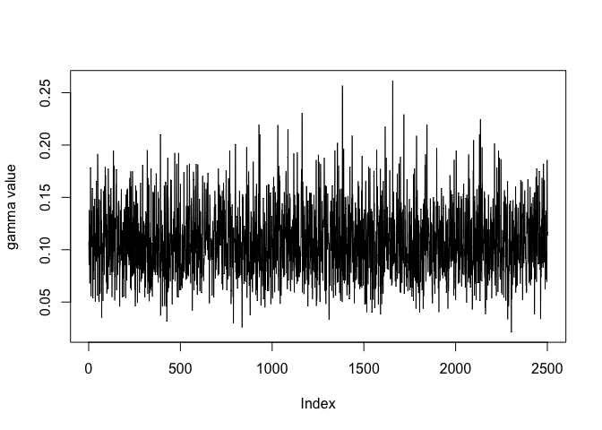
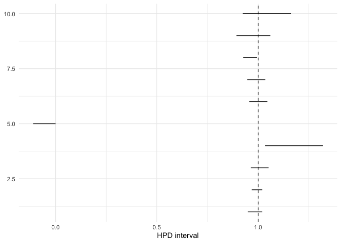
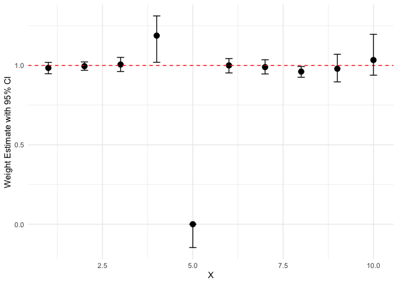
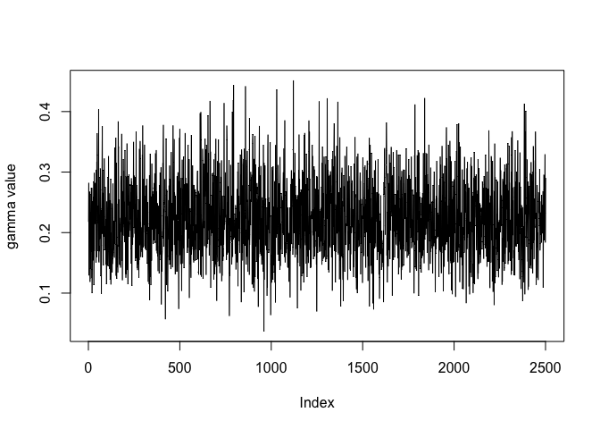
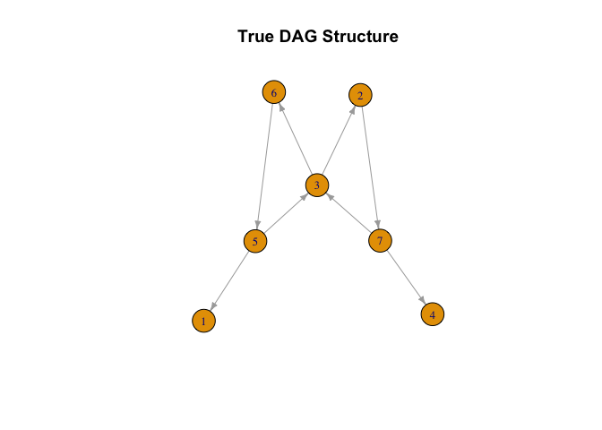
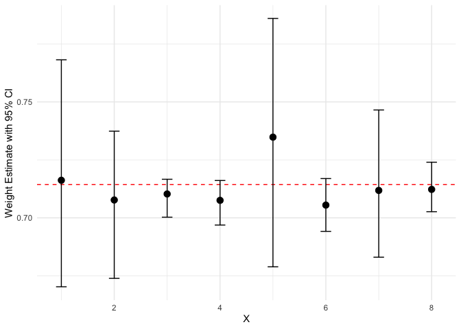

<!-- README.md is generated from README.Rmd. Please edit that file -->

# cyclinbayes

<!-- badges: start -->

<!-- badges: end -->

Cyclinbayes is a R package that provides two bayesian methods for
estimating directed acyclic graphs (DAG) and directed cyclic graphs
(DCG).The framework for estimating DAGs provides rigorous uncertainty
quantification through a probabilistic Bayesian hierarchical model,
supported by hybrid MCMC sampling combined with simulated annealing.
Similarly for DCGs, we again incorporate the probabilistic Bayesian
hierarchical model combined with a random walk algorithm on the Causal
effect coefficients. These additions to the algorithms improved chain
mixing, avoiding local optima, and effectively recovering sparsity
through the spike-and-slab prior formulation. Implemented in Rcpp,
cyclinbayes leverages optimized C++ routines to handle large-scale,
high-dimensional datasets.

## Installation from Github

First, you will need to install the devtools package. From R, we type

``` r
#install.packages("remotes")
#remotes::install_github("roblee01/cyclinbayes")
library(cyclinbayes)
library(ggplot2)
library(SID)
library(pcalg)
#> 
#> Attaching package: 'pcalg'
#> The following object is masked from 'package:SID':
#> 
#>     randomDAG
```

We load

You can install the development version of cyclinbayes from
[GitHub](https://github.com/) with:

``` r
#remotes::install_github("roblee01/cyclinbayes")
```

## Example

This is an example how the first acyclic Bayesian lingam method works.
Let p denote the number of features in the matrix and n be the sample
size of the data. We generate simulation error terms
$\epsilon_{i}^{(q)}$ from the distribution for $i=1\ldots,p$ and
$q=1\ldots,n$: a finite mixture model
$\sum_{k=1}^{M}\pi_{ik}N(\mu_{ik},\tau_{ik})$, where $M = 2$,
$(\mu_{i1},\mu_{i2})=(-0.5,0.5)$, and $(\tau_{i1},\tau_{i2})=(0.1,0.3)$,
and $(\pi_{i1},\pi_{i2})=(0.5,0.5)$. Then to create the true causal
effect matrix, for each entry in the matrix, we sample either 0 or 1
based on sparsity probability $\Delta=0.9$ until the matrix $B$
represents the adjacency matrix of a DAG. we use the generated causal
effect matrix and perform the operation, $\epsilon_{i}^{(q)}$ from
$\vec{Y}_{i} = (I-B)^{-1}\vec{\epsilon}_{i}$ , where
$\vec{\epsilon}_{i} = (\epsilon_{i}^{(1)},\ldots,\epsilon_{i}^{(n)})^{T}$
and $\vec{Y}_{i}=(Y_{i}^{(1)},\ldots,Y_{i}^{(n)})^{T}$.

``` r
#library(cyclinbayes)
set.seed(21)
N = 300 # Sample size for the test data
num_covariates = 10 # number of features for test data
M = 2 # Number of finite clusters for mixed normal in likelihood
num_iter = 10000 # Number of iterations MCMC runs


####################################### hyperparameter setup ###################################################

params = list(
  a_mu = 0,
  b_mu = 2,
  a_gamma = 0.5,
  b_gamma = 0.5,
  a_gamma_1 = 2,
  b_gamma_1 = 1,
  a_tao = 2,
  b_tao = 1,
  a_og_tao = 0.01,
  b_og_tao = 0.01,
  alpha = 1
) 

############################# generating DAG examples ##########################################################
example_list = generates_examples_DAG(num_covariates, N, M, 0.9, 21)

data_matrix = example_list$data_matrix
Adjacency_matrix_true = example_list$Adjacency_matrix_true

#######################################################################################

results_lists = BayesSCLingam(
  data_matrix,
  params$a_mu,
  params$b_mu,
  params$a_gamma,
  params$b_gamma,
  params$a_tao,
  params$b_tao,
  params$a_og_tao,
  params$b_og_tao,
  params$a_gamma_1,
  params$b_gamma_1,
  params$alpha,
  M,
  num_iter
) # Runs the Acyclic algorithm


Adjacency_matrix_means = results_lists$Adjacency_matrix_means 
Adjacency_matrix_list = results_lists$Adjacency_matrix_list 
Causal_effect_matrix_list = results_lists$Causal_effect_matrix_list
gamma_list = results_lists$gamma_list
gamma_1_list = results_lists$gamma_1_list
mu_matrix_list = results_lists$mu_matrix_list
tao_matrix_list = results_lists$tao_matrix_list
pi_matrix_list = results_lists$pi_matrix_list
```

To achieve the most accurate graph structure estimate, we apply
summary_posterior_vec, which selects the best-fitting graph based on
SHD, SID, and the Frobenius norm. SID is only applicable here because we
are sampling DAGs. Our primary estimate is based on SHD, followed by SID
and then the Frobenius norm.

``` r
Adjacency_matrix = posterior_adjacency_analysis(Adjacency_matrix_list,dist_type = 'shd')
Adjacency_matrix
#>       [,1] [,2] [,3] [,4] [,5] [,6] [,7] [,8] [,9] [,10]
#>  [1,]    0    0    1    0    0    0    0    0    0     0
#>  [2,]    0    0    0    0    0    0    0    0    0     1
#>  [3,]    0    0    0    0    0    0    0    0    0     0
#>  [4,]    0    0    0    0    0    0    0    0    0     0
#>  [5,]    1    1    0    0    0    0    0    0    0     0
#>  [6,]    0    0    0    0    0    0    0    0    0     0
#>  [7,]    0    0    0    1    0    0    0    0    0     1
#>  [8,]    0    0    0    0    0    1    0    0    0     0
#>  [9,]    0    0    0    0    0    1    0    0    0     0
#> [10,]    0    0    0    0    0    0    0    1    0     0
```

``` r
Adjacency_matrix = posterior_adjacency_analysis(Adjacency_matrix_list,dist_type = 'sid')
Adjacency_matrix
#>       [,1] [,2] [,3] [,4] [,5] [,6] [,7] [,8] [,9] [,10]
#>  [1,]    0    0    1    0    0    0    0    0    0     0
#>  [2,]    0    0    0    0    0    0    0    0    0     1
#>  [3,]    0    0    0    0    0    0    0    0    0     0
#>  [4,]    0    0    0    0    0    0    0    0    0     0
#>  [5,]    1    1    0    0    0    0    0    0    0     0
#>  [6,]    0    0    0    0    0    0    0    0    0     0
#>  [7,]    0    0    0    1    0    0    0    0    0     1
#>  [8,]    0    0    0    0    0    1    0    0    0     0
#>  [9,]    0    0    0    0    0    1    0    0    0     0
#> [10,]    0    0    0    0    0    0    0    1    0     0
```

``` r
Adjacency_matrix = posterior_adjacency_analysis(Adjacency_matrix_list,dist_type = 'forb')
Adjacency_matrix
#>       [,1] [,2] [,3] [,4] [,5] [,6] [,7] [,8] [,9] [,10]
#>  [1,]    0    0    1    0    0    0    0    0    0     0
#>  [2,]    0    0    0    0    0    0    0    0    0     1
#>  [3,]    0    0    0    0    0    0    0    0    0     0
#>  [4,]    0    0    0    0    0    0    0    0    0     0
#>  [5,]    1    1    0    0    0    0    0    0    0     0
#>  [6,]    0    0    0    0    0    0    0    0    0     0
#>  [7,]    0    0    0    1    0    0    0    0    0     1
#>  [8,]    0    0    0    0    0    1    0    0    0     0
#>  [9,]    0    0    0    0    0    1    0    0    0     0
#> [10,]    0    0    0    0    0    0    0    1    0     0
```

All of this is same as our true Adjacency matrix.

``` r
Adjacency_matrix_true
#>       [,1] [,2] [,3] [,4] [,5] [,6] [,7] [,8] [,9] [,10]
#>  [1,]    0    0    1    0    0    0    0    0    0     0
#>  [2,]    0    0    0    0    0    0    0    0    0     1
#>  [3,]    0    0    0    0    0    0    0    0    0     0
#>  [4,]    0    0    0    0    0    0    0    0    0     0
#>  [5,]    1    1    0    0    0    0    0    0    0     0
#>  [6,]    0    0    0    0    0    0    0    0    0     0
#>  [7,]    0    0    0    1    0    0    0    0    0     1
#>  [8,]    0    0    0    0    0    1    0    0    0     0
#>  [9,]    0    0    0    0    0    1    0    0    0     0
#> [10,]    0    0    0    0    0    0    0    1    0     0
```

We can plot individual parameters, such as the probability of there
being an edge $\gamma$.

``` r
plot(gamma_list[,1][(0.75*num_iter):num_iter],type='l',ylab='gamma value')
```

 Then
see the analysis of this parameter, through our function
summary_posterior_vec. We can get both the 95% credible interval and our
highest posterior density.

``` r
gamma_posterior_summary = summary_posterior_vec(gamma_list,0.95)
gamma_posterior_summary$credible_interval
#>       2.5%      97.5% 
#> 0.05189561 0.17901237
gamma_posterior_summary$hpd_interval[,1]
#>      lower      upper 
#> 0.04550084 0.16964687
```

Below we show the HPD and credible intervals for the estimated causal
effect coefficients, where the red line denotes the true causal weights.
The credible intervals for the nonzero coefficients closely capture the
true values, and the HPD estimates align near the reference line,
indicating that the method accurately identifies both causal strength
and graph structure.

``` r
Causal_effect_matrix_summary = summary_posterior_matrix(Causal_effect_matrix_list,level = 0.95)
hpd_matrix_acyclic = Causal_effect_matrix_summary$hpd_matrix
ci_matrix_acyclic = Causal_effect_matrix_summary$ci_matrix

par(mfrow=c(2,1))
num_non_zero_coef = ncol(hpd_matrix_acyclic[,which(colSums(hpd_matrix_acyclic)!=0)])
data_1 = data.frame(cbind(1:num_non_zero_coef,t(hpd_matrix_acyclic[,which(colSums(hpd_matrix_acyclic)!=0)])))


ggplot(data_1) +
  geom_segment(aes(x = lower, xend = upper, y = V1, yend = V1)) +
  geom_vline(xintercept = 1, linetype = "dashed") +
  labs(y = NULL, x = "HPD interval") +
  theme_minimal()
```



``` r


data_2 = data.frame(ci_matrix_acyclic[which(rowSums(ci_matrix_acyclic)!=0),])
x = 1:nrow(data_2)
data_2 = cbind(x,data_2)

ggplot(data_2, aes(x = x, y = X2)) +
  geom_point(size = 3) +
  geom_hline(yintercept = 1, linetype = "dashed", color = "red") +
  geom_errorbar(aes(ymin = X1, ymax = X3), width = 0.2) +  # just X1/X3
  labs(y = "Weight Estimate with 95% CI", x = "X") +
  theme_minimal()
```



This is an example of how the cyclic Bayesian sampler works. We generate
the Adjacency matrix first making sure we get a cyclic graph. Then in
order to guarantee the inverse of $I-B$, we constrain the spectral
radius of causal effect matrix B. For now we set the current adjacency
matrix as B. We then calculate $\rho(B)$, the largest modulus of the
eigenvalue of B. If $|\rho(B)|\geq 0.95$, we rescale the causal effect
matrix to be $(0.95/\rho(B))B$, to guarantee the spectral radius is less
than 0.95.

``` r
library(cyclinbayes)
N = 250 # Sample size for the test data
num_covariates = 7 # Number of features for test data
M = 2 # Number of finite clusters for mixed normal in likelihood
num_iter = 10000 # Number of iterations MCMC runs

####################################### hyperparameter setup ###################################################

params = list(
  a_mu = 0,
  b_mu = 2,
  a_gamma = 2,
  b_gamma = 1,
  a_gamma_1 = 2,
  b_gamma_1 = 1,
  a_tao = 2,
  b_tao = 1,
  alpha = 1
)

############################# generating examples #############################

example_list = generates_examples_DCG(num_covariates, N, M, 0.9, 21)

data_matrix = example_list$data_matrix
Adjacency_matrix_true = example_list$Adjacency_matrix_true
Causal_effect_matrix_true = example_list$Causal_effect_matrix_true

###############################################################################

results_list = BayesCD(
  data_matrix,
  params$a_mu,
  params$b_mu,
  params$a_gamma,
  params$b_gamma,
  params$a_tao,
  params$b_tao,
  params$a_gamma_1,
  params$b_gamma_1,
  params$alpha,
  M,
  num_iter
)

Adjacency_matrix_means = results_list$Adjacency_matrix_means 
Adjacency_matrix_list = results_list$Adjacency_matrix_list 
Causal_effect_matrix_list = results_list$Causal_effect_matrix_list
gamma_list = results_list$gamma_list
gamma_1_list = results_list$gamma_1_list
mu_matrix_list = results_list$mu_matrix_list
tao_matrix_list = results_list$tao_matrix_list
pi_matrix_list = results_list$pi_matrix_list
```

To obtain the most accurate estimate of the graph structure, we use
summary_posterior_vec, which identifies the best-fitting graph based on
the Structural Hamming Distance (SHD) and the Frobenius norm. The
Structural Intervention Distance (SID) is not applicable here since the
sampled graphs are not restricted to DAGs. The example below illustrates
this procedure.

``` r
posterior_adjacency_analysis(Adjacency_matrix_list,dist_type = 'sid')
#> [1] "Graph structure needs to be DAG"
```

``` r
posterior_adjacency_analysis(Adjacency_matrix_list,dist_type = 'shd')
#>      [,1] [,2] [,3] [,4] [,5] [,6] [,7]
#> [1,]    0    0    0    0    0    0    0
#> [2,]    0    0    0    0    0    0    1
#> [3,]    0    1    0    0    0    1    0
#> [4,]    0    0    0    0    0    0    0
#> [5,]    1    0    1    0    0    0    0
#> [6,]    0    0    0    0    1    0    0
#> [7,]    0    0    1    1    0    0    0
```

``` r
posterior_adjacency_analysis(Adjacency_matrix_list,dist_type = 'forb')
#>      [,1] [,2] [,3] [,4] [,5] [,6] [,7]
#> [1,]    0    0    0    0    0    0    0
#> [2,]    0    0    0    0    0    0    1
#> [3,]    0    1    0    0    0    1    0
#> [4,]    0    0    0    0    0    0    0
#> [5,]    1    0    1    0    0    0    0
#> [6,]    0    0    0    0    1    0    0
#> [7,]    0    0    1    1    0    0    0
```

All of this is same as our true Adjacency matrix.

``` r
Adjacency_matrix_true
#>      [,1] [,2] [,3] [,4] [,5] [,6] [,7]
#> [1,]    0    0    0    0    0    0    0
#> [2,]    0    0    0    0    0    0    1
#> [3,]    0    1    0    0    0    1    0
#> [4,]    0    0    0    0    0    0    0
#> [5,]    1    0    1    0    0    0    0
#> [6,]    0    0    0    0    1    0    0
#> [7,]    0    0    1    1    0    0    0
```

We again plot individual parameters, such as the probability of there
being an edge $\gamma$.

``` r
plot(gamma_list[,1][(0.75*num_iter):num_iter],type='l',ylab='gamma value')
```


Then see the analysis of this parameter, through our function
summary_posterior_vec. We can get both the 95% credible interval and our
highest posterior density.

``` r
gamma_posterior_summary = summary_posterior_vec(gamma_list,0.95)
gamma_posterior_summary$credible_interval
#>      2.5%     97.5% 
#> 0.1153429 0.6389309
gamma_posterior_summary$hpd_interval[,1]
#>      lower      upper 
#> 0.08967298 0.57338765
```

``` r
Causal_effect_matrix_summary = summary_posterior_matrix(Causal_effect_matrix_list,level = 0.95)
hpd_matrix_acyclic = Causal_effect_matrix_summary$hpd_matrix
ci_matrix_acyclic = Causal_effect_matrix_summary$ci_matrix

par(mfrow=c(2,1))
num_non_zero_coef = ncol(hpd_matrix_acyclic[,which(colSums(hpd_matrix_acyclic)!=0)])
data_1 = data.frame(cbind(1:num_non_zero_coef,t(hpd_matrix_acyclic[,which(colSums(hpd_matrix_acyclic)!=0)])))


ggplot(data_1) +
  geom_segment(aes(x = lower, xend = upper, y = V1, yend = V1)) +
  geom_vline(xintercept = 0.7143305, linetype = "dashed") +
  labs(y = NULL, x = "HPD interval") +
  theme_minimal()
```



``` r


data_2 = data.frame(ci_matrix_acyclic[which(rowSums(ci_matrix_acyclic)!=0),])
x = 1:nrow(data_2)
data_2 = cbind(x,data_2)

ggplot(data_2, aes(x = x, y = X2)) +
  geom_point(size = 3) +
  geom_hline(yintercept = 0.7143305, linetype = "dashed", color = "red") +
  geom_errorbar(aes(ymin = X1, ymax = X3), width = 0.2) +  # just X1/X3
  labs(y = "Weight Estimate with 95% CI", x = "X") +
  theme_minimal()
```


